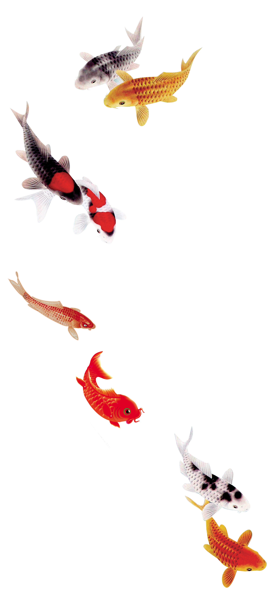

<h2>  Hi 👋, I'm Fernando Brandão</h2> 
<h4> Web development</h4>

 
- 🔥 Pushing myself to reenter the development area   
- 💾 Delphi and Java developer 2006 2007  
- 💻 I already done some refresh modules at Alura   
- 🔭 I started by front-end but intent getting the back-end  
- 🧑‍💻 I’m currently pointing to JAVASCRIPT | NODE | REACT   
- 📬 mail me: f3rnandobrandao@gmail.com  
- 📈 I looking for opportunity in a team  

## &nbsp;Tech Stack

&nbsp;
&nbsp;
&nbsp;
&nbsp;
&nbsp;
&nbsp;
&nbsp;

<!---->
 
 
♻️ There is no Planet B 🌎
